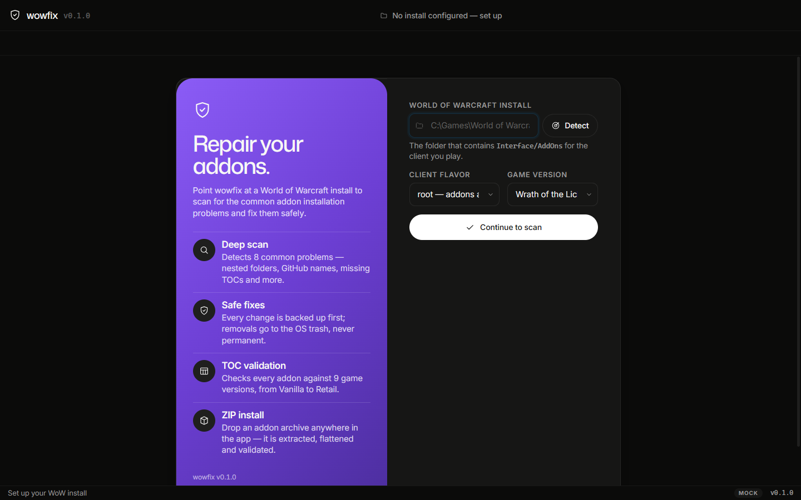
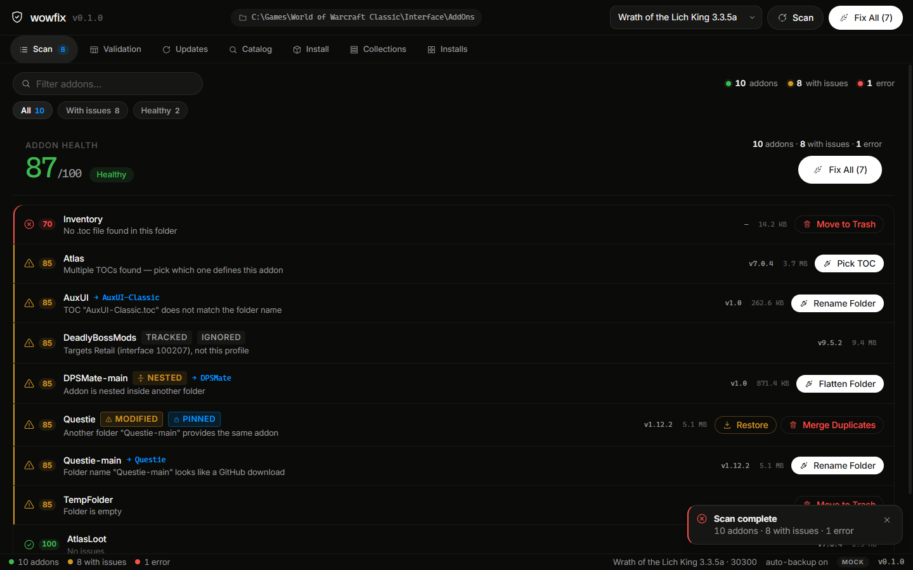
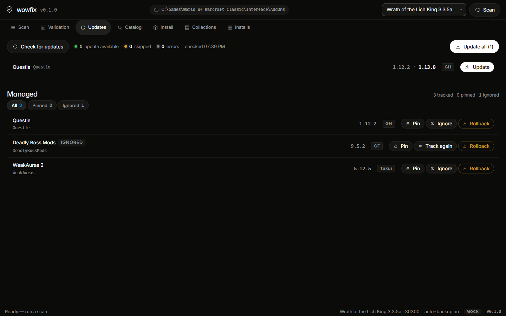
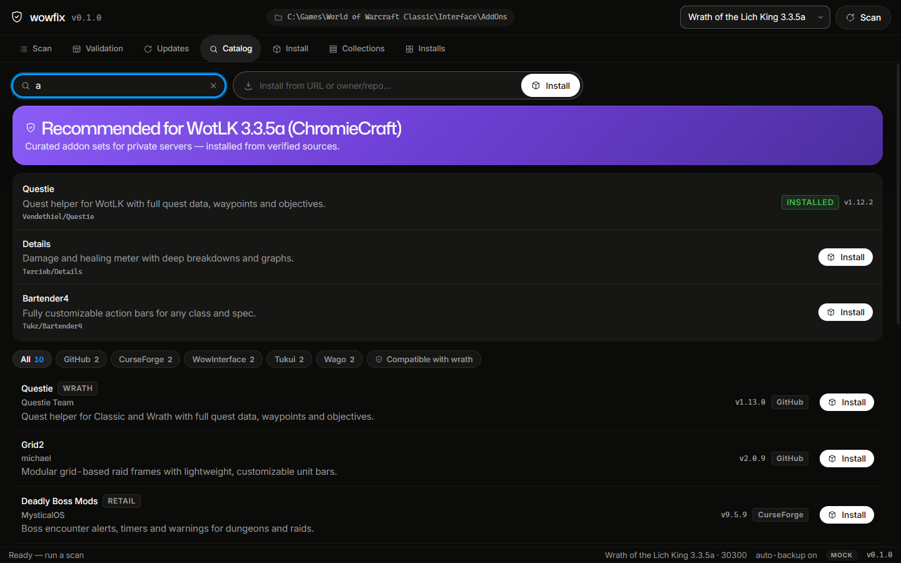

# wowfix

wowfix scans your World of Warcraft `Interface/AddOns` folder, finds the common
addon installation problems, repairs them safely (with backups and trash),
validates TOC compatibility and installs addons from ZIP archives. It ships as a
Windows desktop GUI (Wails v2 + WebView2) and a cross-platform CLI — one engine,
two front-ends.

   

---

## Screenshots

The desktop GUI in mock mode (1440×900), followed by a text preview of the
scan list as rendered by the retired terminal UI:

**Setup** — install picker with gradient spotlight cards:


**Scan** — per-addon issues with fix actions:


**Updates** — tracked addons with pin/ignore/rollback controls:


**Catalog** — provider search and the curated band with gradient spotlight cards:


**Design language** — the desktop GUI is dark-only, drawn on a near-black
canvas (`#0b0b0a`) with warm charcoal surfaces. Primary actions are white
pills with black text; secondary controls are charcoal pills; accent blue is
reserved for links, focus and selection. Display type is Mona Sans Variable
with tight negative letter-spacing, body copy is Inter Variable with OpenType
character variants, and gradient spotlight cards are used sparingly (setup
screen, catalog's curated band).

**Regenerating screenshots** — run `cd frontend && npm install && npm run
dev`, open `http://localhost:5173/?mock=1&view=<view>` (`?mock=1&state=setup`
for first-run) and capture at ~1440×900.

A text preview of the scan list, as rendered by the retired terminal UI:

```
── LIST ──
⚔ wowfix dev C:\Games\World of Warcraft\Interface\AddOns  ·  3.3.5.12340 · Wrath of the Lich King 3.3.5a (expected interface 30300)  ·  flavor root
╭──────────────────────────────────────────────────────────────────────────────────────────────────╮
│ STATUS   ADDON                VERSION  SRC   PROBLEM                            FIX              │
│ ▍  ✖      Inventory            —        local No .toc file found in this folder  Move to Trash   │
│   ⚠      Aux                  1.0      local TOC "Aux-Classic.toc" does not ma… Rename Folder    │
│   ⚠      DPSMate              1.0      local Nested folder                      Flatten Folder   │
│   ⚠      GFW_Shaman           —        local Vanilla addon                                       │
│   ⚠      Questie-main         1.12.2   GH    Folder name "Questie-main" looks … Rename Folder    │
│   ⚠      TempFolder           —        local Folder is empty                    Move to Trash    │
│   ✔      AtlasLoot            7.0.4    CF    —                                                   │
│   ✔      BigWigs              —        local —                                                   │
╰──────────────────────────────────────────────────────────────────────────────────────────────────╯
```

## Features

- **Scan & detect** — every folder in `Interface/AddOns` is analyzed for:
  1. **GitHub folder names** — `Questie-main` → rename to `Questie` (`-main`, `-master`, `-dev`, version suffixes)
  2. **TOC name mismatch** — `Aux/` containing `Aux-Classic.toc` → rename folder to `Aux-Classic`
  3. **Nested folders** — `DPSMate-main/DPSMate/DPSMate.toc` → flatten to top level
  4. **Missing TOC** — folder without any `*.toc` → marked invalid, move to trash offered
  5. **Multiple TOCs** — `Atlas.toc` + `Atlas_Wrath.toc` + `Atlas_TBC.toc` → user picks the defining TOC
  6. **Empty folders** — detected, optionally trashed
  7. **Duplicate addons** — `Questie/` + `Questie-main/` → merge or delete
  8. **Broken extraction structure** — several addons dumped into one folder → promoted to top level
- **TOC validation** — parses every TOC, reports `Expected interface / Detected interface / Status`
  against any of 9 profiles: Vanilla 1.12, TurtleWoW, TBC 2.4.3, WotLK 3.3.5a,
  Cataclysm, Classic Era, Hardcore, Season of Discovery, Retail. TOCs are never edited.
- **ZIP installer** — `wowfix install addon.zip` extracts, flattens, renames and
  validates before installing. Drag-and-drop works (drop a zip onto the executable).
- **Catalog & providers** — `wowfix search <query>` queries GitHub,
  CurseForge, WowInterface, Tukui and Wago in parallel and merges the
  results; `wowfix install <url|owner/repo>` installs straight from any
  provider. Wago adds WeakAuras and Plater imports from wago.io:
  search + download the import string for in-game import (a Wago
  "download" is a plain-text import string, not an addon archive, and
  Wago-hosted addon archives are not covered).
- **Update manager** — catalog installs are tracked in a registry;
  `wowfix update` checks every tracked addon
  against its provider and applies newer releases. Update safety:
  updates targeting a different game version are flagged (⚠) and
  skipped by default unless you confirm.
- **Pin / ignore / rollback** — tracked addons can be pinned (locked at
  their current version, skipped by update checks until unpinned) or
  ignored (excluded from update management entirely); any tracked addon
  can be rolled back to its most recent backup snapshot (the current
  state is snapshotted first, and the addon is re-pinned afterwards).
- **Integrity tracking** — every catalog install/update records a content
  checksum of the installed addon folder, so post-install drift (manual
  edits, tampering, partial overwrites) can be detected.
- **Offline catalog snapshots** — `wowfix snapshot export` freezes the
  tracked addons with their latest known versions into a portable JSON
  file while online; `wowfix snapshot check` diffs it against the
  registry with no network, so update status works offline.
- **Curated private-server sets** — a hand-verified manifest of
  known-good addons for the vanilla-family clones (Turtle-style 1.12
  clients) and ChromieCraft (WotLK 3.3.5a), each anchored to a GitHub
  source and installed through the existing providers with
  `wowfix curated list` / `wowfix curated install`.
- **Addon profiles** — capture the current addon setup as a named
  collection (PvE/PvP/Raiding/Leveling presets) and switch between
  them; switching renames folders to `<name>.disabled` and back.
- **SavedVariables** — back up, restore, reset and migrate between
  accounts the per-account `SavedVariables` files under
  `WTF/Account/<account>/`.
- **Import / Export** — share addon setups as a JSON or YAML manifest,
  a bundle ZIP (manifest + local addon folders + SavedVariables) or a
  GitHub repo list; importing installs through the catalog.
- **Backups** — every mutation is preceded by a `Backups/<timestamp>/` snapshot;
  `wowfix restore` brings folders back (the current state is snapshotted first).
- **Trash, never delete** — removals go to the OS trash (Recycle Bin on Windows,
  XDG trash on Linux, `~/.Trash` on macOS) with a cross-device fallback.
- **Auto-detection** — finds WoW installs in standard locations, Battle.net/Steam
  registry keys (Windows), Wine/Lutris/Proton prefixes (Linux), Applications (macOS);
  the game version is read from the client executable's PE version resource.
- **Logging** — every action is logged in a ring buffer and exportable to text.
- **Config** — saved in the platform user config dir; remembers the WoW path,
  flavor, profile, theme (dark only), and last scan.

## Install / Build

Requires Go 1.25+ (the desktop GUI pins wails v2.13.0, which requires
Go 1.25). Node.js 18+ and npm are needed to build the GUI frontend.

CLI (Windows/Linux/macOS):

```sh
go build -o wowfix ./cmd/wowfix
```

Desktop GUI (Windows, WebView2 runtime required):

```sh
wails build                         # -> build/bin/wowfix.exe
wails build -nsis                   # + build/bin/wowfix-setup.exe installer
```

Version metadata:

```sh
go build -ldflags "-X main.version=1.0.0 -X main.commit=$(git rev-parse --short HEAD)" \
  -o wowfix ./cmd/wowfix
```

Cross-compile:

```sh
GOOS=windows GOARCH=amd64 go build -o wowfix.exe ./cmd/wowfix
GOOS=linux   GOARCH=amd64 go build -o wowfix      ./cmd/wowfix
GOOS=darwin  GOARCH=arm64 go build -o wowfix      ./cmd/wowfix
```

## Usage

### Desktop GUI

The primary interface is a Windows desktop app built with
Wails v2 (https://wails.io) on WebView2:

```sh
wails build   # -> build/bin/wowfix.exe
```

The GUI uses a 6-destination sidebar:

- **Overview** — health workflows behind a segmented control: **Scan** (scan & fix), **Doctor** (environment diagnostics), **Validation** (TOC compatibility table).
- **Updates** — primary "Update all"; per-row Update with ⋯ overflow menu (Pin/Ignore/History…/Rollback); a Managed section for tracked addons with explicit Pin/Ignore/Rollback buttons. "History…" opens a per-addon version log (newest first, Current marker) with per-row Rollback that re-downloads that exact version from the provider (GitHub tags, CurseForge files); providers that only serve the latest (WowInterface, Tukui) show an honest "can no longer re-download version X" error.
- **Catalog** — single install surface: search, URL/owner-repo install bar, **Browse…** for local ZIPs, drag-drop ZIPs onto the bar; curated band; provider filters; info panel; Wago import.
- **Collections** — named addon loadouts with enable toggles.
- **Backups** — backup list + Snapshot section (export JSON → Copy; paste → offline Check diff).
- **Settings** — Behavior, Paths & API key, Managed elsewhere, plus an **Installations** section (per-install cards: health, stats, Scan / Set as active, Update all installs).

A command palette opens with **Ctrl+K** (or **Ctrl+P**) — searchable actions to navigate any destination or run primary actions (Scan now, Fix all problems, Run diagnostics, Validate addons, Check for updates, Update all addons, Create backup, Refresh current view). A muted "Ctrl+K" chip sits at the right end of the statusbar. Navigation uses ArrowUp/Down + Enter + Esc.

**SavedVariables** is reachable via deep link `?view=savedvars`: account picker, file list — listing an account's files automatically creates one backup per account per session (toast with the path); the manual Back up button always works; failed auto-backups are retried on the next successful list. Restore/Reset/Migrate behind an "Advanced operations" disclosure.

All deep links (`?view=scan, doctor, validate, install, installs, savedvars, exportimport, updates, catalog, collections, backups, settings, overview`) still mount every surface — the mock screenshot workflow (`?mock=1&view=<view>`) is unchanged.

Destructive actions confirm in the UI and follow the
[safety model](#safety-model) below (backups first, trash, never delete).

### CLI

```
wowfix                        show this help (the desktop GUI is the primary interface)
wowfix scan                   scan the AddOns folder and report problems
wowfix fix [--yes]            fix all detected problems (backups first)
wowfix install <addon.zip>    install an addon archive [--yes]
wowfix install <url|owner/repo>  install from a provider source
wowfix validate               validate TOC compatibility
wowfix list                   list addons with status
wowfix search <query>         search the addon catalog
wowfix update [--yes]         check and apply addon updates
wowfix history <folder> [--json]  show per-addon version history (newest first, Current marker)
wowfix rollback <folder> <version>  rollback an addon to a specific version (re-downloads from provider)
wowfix snapshot export|check <file>  export/check an offline catalog snapshot (export online, check offline)
wowfix sources                list catalog providers and their caveats
wowfix curated list [--flavor <family>]  list curated private-server addons for a game family
wowfix curated install <name> install a curated addon for the active family
wowfix backup                 snapshot all addons
wowfix restore [id]           list backups, or restore one
wowfix doctor                 check environment and permissions
wowfix config [set <key> <val>]  show or edit configuration
wowfix profile                manage addon collections (list/show/create/duplicate/
                              rename/delete/switch/enable/disable)
wowfix savedvars              list/back up/restore/reset/migrate SavedVariables
wowfix export <out.json|out.yaml|out.zip>  export a collection [--collection <id>] [--savedvars]
wowfix import <file|url>      import a manifest (JSON/YAML), bundle zip or GitHub repo list
wowfix version                print version
wowfix help                   show this help
```

Common flags: `--path <dir>` (WoW root, overrides config), `--yes` (skip
prompts), `--json` (machine-readable output for `scan`/`list`/`validate`/
`search`/`sources`/`install`/`restore`/`config`/`profile`/`savedvars`/
`export`/`import`). Command-specific flags: `--account <name>` and
`--dest <dir>` (`savedvars`), `--from <account>` `--to <account>` and
`--addon <name>` (`savedvars migrate`), `--collection <id>` and
`--savedvars` (`export`).

`install` accepts a local `.zip`, a provider URL (CurseForge, WowInterface,
Tukui, GitHub) or a GitHub `owner/repo` pair. `search` degrades gracefully
when a provider is unreachable: the working results are printed and the
provider errors go to stderr. GitHub's unauthenticated API is rate-limited
to ~60 requests/hour per IP. Wago's aura API (data.wago.io) is undocumented
but stable and keyless — it is the same API the official WeakAuras
Companion uses — with no stated rate limits; keep calls sparse. Wago
downloads are import strings for in-game import, not archives.

### Configuration

Stored at `os.UserConfigDir()/wowfix/config.json`:

- `wow_path` — WoW installation root
- `flavor` — client subfolder (`_retail_`, `_classic_`, `_classic_era_`, `_classic_tbc_`, or root)
- `profile` — one of `vanilla, turtle, tbc, wrath, cata, classic, hardcore, sod, retail`
- `theme` — `dark` only (the UI is dark-only; the CLI accepts and stores
  `light` but nothing consumes it)
- `auto_backup` — snapshot before every mutation (default `true`)
- `confirmations` — confirm destructive actions (default `true`)
- `backups_dir` — override the `Backups/` location (default: next to the game)
- `curseforge_api_key` — enables the modern CurseForge Core API
  (without it the catalog falls back to the deprecated legacy endpoint);
  the `WOWFIX_CURSEFORGE_API_KEY` environment variable takes precedence
- `collection` — the active addon-collection id (set by `profile switch`)
- `collections_dir` — where collection files live (default: `<config dir>/collections`)

```sh
wowfix config set wow_path "D:\Games\World of Warcraft"
wowfix config set profile wrath
wowfix config set theme dark
wowfix config set curseforge_api_key "xxxxxxxx-xxxx-xxxx-xxxx-xxxxxxxxxxxx"
WOWFIX_CURSEFORGE_API_KEY=... wowfix search weakauras
```

### Addon Profiles

A profile (called "collection" in the config and CLI to avoid colliding
with the game-version `profile` key) is a named snapshot of which addons
are enabled. WoW disables an addon when its folder name ends in
`.disabled`, so switching a collection renames folders between `<name>`
and `<name>.disabled` — nothing is deleted and every switch is preceded
by a backup snapshot.

```sh
wowfix profile create pve            # capture the current setup
wowfix profile list                  # list collections (active marked)
wowfix profile show pve              # per-addon enable/disable state
wowfix profile duplicate pve raiding # copy a collection
wowfix profile rename pve pvp        # rename (id stays stable)
wowfix profile enable pve Questie    # flip one addon's state
wowfix profile disable pve Dead      # ...
wowfix profile switch pve --yes      # apply: renames folders, sets config collection
wowfix profile delete pve
```

Collections live as one `<id>.json` file per
collection in `collections_dir` (default `<config dir>/collections`);
ids are sanitized names, `-2`, `-3`, ... appended on collisions.

### SavedVariables

Addon settings live in `<wtfRoot>/Account/<account>/SavedVariables/*.lua`
where `wtfRoot` is derived from the install (`<root>/WTF` for root
installs, `<root>/<flavor>/WTF` for flavor subfolders).

```sh
wowfix savedvars list                        # files of the first account
wowfix savedvars list --account "123#1"      # or an explicit account
wowfix savedvars backup --dest D:\sv-backups # timestamped copy, prints path
wowfix savedvars restore D:\sv-backups\2026-…  # restores; current state snapshotted first
wowfix savedvars reset DBM                   # deletes DBM.lua (exact stem: DBM-Core.lua survives)
wowfix savedvars migrate --from "123#1" --to "alt#1"          # copy all SavedVariables between accounts
wowfix savedvars migrate --from "123#1" --to "alt#1" --addon DBM  # copy a single addon's settings
```

With several accounts and no `--account`, the first is used and the
choice is announced. Restore refuses paths outside the WTF root, and
reset matches the exact file stem so `DBM` never deletes `DBM-Core.lua`.
Migration never overwrites existing destination files (they are skipped
and reported) and requires both accounts to exist.

### Import / Export

A manifest is JSON describing an addon setup:

```json
{
  "version": 1,
  "name": "pve",
  "game_version": "wrath",
  "addons": [
    {"folder": "Questie", "provider": "github", "id": "Vendethiel/Questie",
     "source": "Vendethiel/Questie", "version": "1.2.3"},
    {"folder": "LocalOnly"}
  ]
}
```

`provider`/`id`/`source` describe where to install the addon from
(`source` is the URL form accepted by `install`); entries without a
provider are local-only and travel inside a bundle.

```sh
wowfix export out.json                    # manifest of the current setup
wowfix export out.yaml                    # the same manifest as YAML
wowfix export bundle.zip --savedvars      # bundle: manifest + local addon folders + SavedVariables
wowfix export out.json --collection pve   # export a specific collection
wowfix import out.json                    # install remote entries; local ones are checked/skipped
wowfix import out.yaml                    # YAML manifests import the same way
wowfix import bundle.zip                  # installs remote + local entries, restores savedvars/
wowfix import https://gist.github.com/…/list.txt   # one "owner/repo" per line, # = comment
```

A manifest is JSON or YAML describing an addon setup; the extension
(`.json`, `.yaml`, `.yml`) picks the format on import.

A bundle zip contains `manifest.json` at the root, local addon folders
under `addons/<Folder>/` and SavedVariables under `savedvars/` (restored
into the first account's SavedVariables on import). Zip entries are
checked against path traversal before anything is extracted, and local
addons are never silently overwritten. Importing a bundle with remote
addons requires the catalog (`wowfix import` wires it automatically).

## Safety model

1. **Never overwrite without confirmation** — every rename/replace/trash/restore
   goes through a confirmation prompt (CLI) or a dialog in the desktop GUI; `--yes` opts out explicitly.
2. **Always back up first** — each affected folder is copied to
   `Backups/<timestamp>/` before any change; disabled only via `auto_backup: false`.
3. **Never delete permanently** — removal means moving to the OS trash; if no
   native trash exists (or it fails, e.g. cross-device), a copy is kept in the
   fallback trash directory and the source is removed.
4. **Permission errors are graceful** — unreadable folders are reported per-addon
   and never abort a scan; unwritable destinations fail with a clear message.

## Architecture

```
cmd/wowfix/          CLI entry point (command dispatch, JSON output)
cmd/wowfix-gui/      desktop GUI entry point (Wails v2)
internal/
  service/           Wails-bound API facade (scan/fix/validate/install)
  gui/               shared Wails application wiring (options, bindings)
  models/            shared data types: Addon, TOC, Issue, Profile
  catalog/           providers (GitHub/CurseForge/WowInterface/Tukui/Wago), registry, updater
  scanner/           detection only — never touches the filesystem
  validator/         TOC parser + compatibility classification
  fixer/             repairs: rename, flatten, merge, delete (with backups)
  installer/         ZIP extraction, normalization, install, validate
  backup/            timestamped snapshots + manifest + restore
  profiles/          addon collections: capture, apply (.disabled renames)
  savedvars/         SavedVariables backup/restore/reset under WTF/Account
  importexport/      manifest/bundle/GitHub-list export & import
  detector/          WoW install discovery + PE version parsing
  config/            persisted user configuration
  logger/            ring-buffer logger with file sink + export
  utils/             filesystem helpers, cross-platform trash, PE parser
```

The core packages (scanner, validator, fixer, installer, backup, catalog,
config, profiles, savedvars, importexport) are pure business logic with
no UI dependency — the CLI and the desktop GUI are two thin front-ends over the
same engine, so the whole feature set is available from both.

## Testing

```sh
go test ./...
go test ./internal/e2e/ -count=1 -v   # end-to-end pipeline: scan -> fix -> backup/restore -> install
go vet ./...
```

The scanner and validator have unit tests covering every detection rule and
every compatibility classification. The `internal/e2e` test drives the whole
pipeline against a fake `Interface/AddOns` tree in a temp dir: it scans the
fixture, fixes every problem (with backups and trash), restores a corrupted
tree from a snapshot and installs addons from a ZIP archive. A manual
smoke-test fixture lives in `testdata/wow`:

```sh
wowfix scan     --path testdata/wow
wowfix fix      --path testdata/wow --yes
wowfix restore  --path testdata/wow
```

**CI** — a GitHub Actions workflow (`.github/workflows/ci.yml`) runs
`gofmt`, `go vet`, tests and the CLI build on Ubuntu and Windows, cross-
compiles the CLI for linux/amd64, darwin/arm64 and windows/amd64, and
builds the Windows desktop GUI with `wails build` in a dedicated job.

## Extensibility

The architecture is designed so the tool can grow into a full addon manager
without refactoring:

- **Providers** — a provider is one `catalog.Provider` implementation
  (`Search`, `Resolve`, `Latest`, `Download`); the merged search, the
  registry and the updater all treat providers uniformly, so adding
  Wago, GitLab or a private source is a new file, not a rewrite.
- **Profiles** — the profile table in `models` is the single source of truth;
  addon collections (enable/disable state per addon) are implemented in
  `internal/profiles`.
- **Import/export** — collection sharing ships as `internal/importexport`
  (manifest, bundle zip, GitHub repo list); new formats are thin
  serializers over the same `Manifest` type.
- **Plugin rules** — scanner issues are plain data (`IssueKind`); new rules plug
  into `analyzeEntry` without touching the fixer.
- **Public API** — all business logic lives in importable packages with no UI
  coupling, so a desktop GUI, web UI, REST API or scripting front-end can be
  built against the same engine.

## Roadmap

- Other provider plugins (the provider interface is ready; a new
  source is a new `catalog.Provider` implementation)
- Catalog screenshots (thumbnails of addon pages in the catalog browser)
- Plugin-architecture formalization (stable public interfaces so
  third-party scanner rules and providers can be loaded without forks)

## License

Proprietary — see [LICENSE](LICENSE). Copyright (c) 2026 Zendevve. All rights
reserved. Personal, non-commercial use within World of Warcraft is permitted;
modification, redistribution, and reuse of the source code require prior
written permission from the copyright holder.
